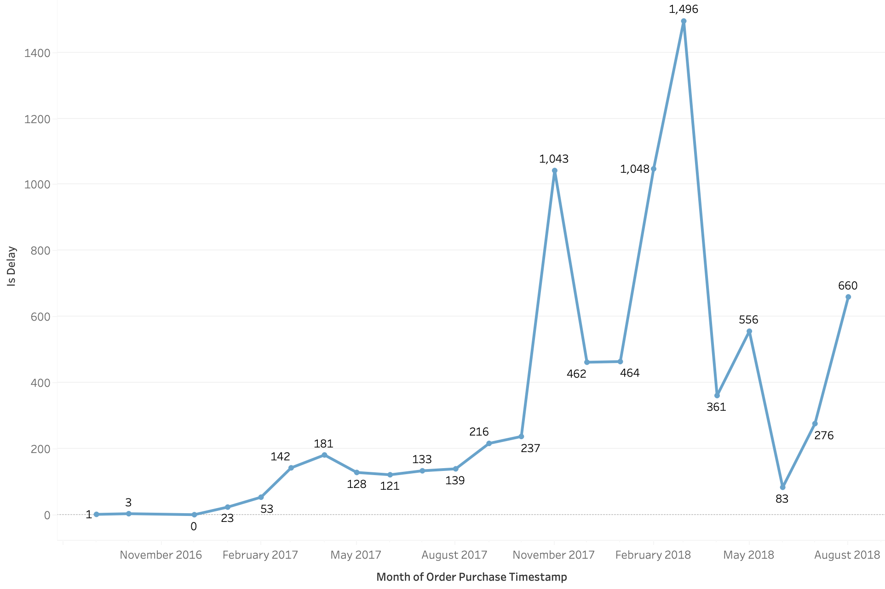
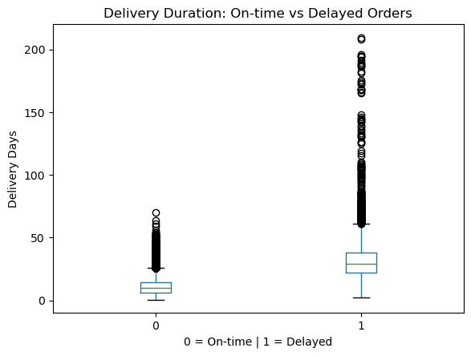
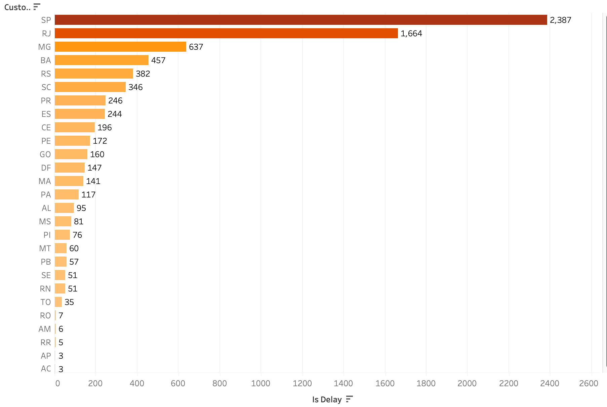

# Olist Brazilian E-commerce Delivery Delay Analysis

## 1. Project Overview
This project investigates delivery delays for orders on Olist, a large Brazilian e-commerce platform. Using relational order, product and logistics data, I identify critical drivers of late delivery, quantify their impacts, and deliver actionable recommendations to help sellers and logistics teams reduce delay risk and improve customer experience.

## 2. Business Background & Analysis Goal
Late delivery hurts customer satisfaction, increases negative reviews, and damages the platform’s reputation. Olist’s logistics network covers a wide range of regions across Brazil, with varying product specifications and shipping costs.

This project aims to:
- Discover key features correlated with delivery delay
- Build predictive models to rank feature importance and identify top drivers of delay
- Generate practical recommendations for sellers and logistics operators to mitigate delivery risks

## 3. Dataset & Tools
### Dataset
This project uses the public Olist Brazilian e-commerce dataset. Out of its 9 relational tables, 5 tables are selected and used for analysis, covering order information, customer information, product attributes, payment details, and items data.

### Tools
- **Python (Pandas)**: Data cleaning, preprocessing, and structured data preparation
- **PostgreSQL**: Multi-table joining, exploratory statistical analysis
- **Tableau**: Data visualization and business insight discovery
- **Machine Learning (Random Forest)**: Feature importance ranking and delay factor verification

## 4. Data Preprocessing
Raw CSV files were cleaned using Pandas to resolve parsing issues caused by unescaped quotation marks. Irrelevant text review datasets were dropped to avoid import errors. Cleaned datasets were then imported into PostgreSQL.

Duplicates and invalid records were checked first. Rows with missing estimated or actual delivery dates were excluded, since these records cannot determine if an order is delayed. After filtering, the remaining dataset had missing values as shown in the table: `total_weight`, `avg_length`, `avg_height`, `avg_width` each had 16 missing records; `avg_photos` had 1332 missing records; `payment_type` and `avg_installments` each had 1 missing record. Missing numeric metrics including item dimension/weight attributes, average photo count and average installments were imputed with median values, and missing `payment_type` entries were filled using the mode. Categorical fields were prepared for multi-table joins across the 5 selected tables.

## 5. Exploratory Data Analysis
Exploratory Data Analysis was conducted in Tableau to understand the overall pattern of delivery delays. Three core business dimensions were examined: temporal trend of delays, distribution of delay duration, and geographic variation in delay rates.

### 5.1 Delay Trend Over Time

**Key Insight**:
The total volume of delayed orders shows a clear upward trend from late 2016 to early 2018. Delays remained very low through most of 2017, then spiked sharply starting in November 2017, hitting a peak of 1,496 delayed orders in February 2018. After this peak, delayed order counts fluctuated but stayed much higher than the 2016–mid-2017 baseline. This time-series pattern suggests that seasonal or operational changes in late 2017 significantly worsened delivery performance.

### 5.2 Distribution of Delivery Delay Duration

**Key Insight**:
The boxplot compares delivery lead time distributions between on-time and delayed orders. On-time orders typically arrive within roughly 10–20 days. Delayed orders have a median delivery duration around 30 days, with a wide spread and many extreme outliers exceeding 100 days. The chart shows the clear separation in delivery lead time between the two groups.

### 5.3 Regional Variation in Order Delay Count

**Key Insight**:
This horizontal bar chart shows the total count of delayed orders across Brazilian states. São Paulo has the highest delayed order volume of 2,387, followed by Rio de Janeiro with 1,664 delayed orders. Most other states record far fewer delayed orders. This concentration matches the fact that Brazil’s southeast region holds the largest customer base; this metric represents absolute delayed order count rather than delay percentage.

## 6. SQL Analysis
SQL was used to join multiple raw tables and construct a unified analytical dataset from the Olist dataset. The query assembled fields from orders, order items, products, payments and customer tables to build the final join table, formalizing the table relationships explored in Section 5 for downstream predictive modelling.

The SQL workflow mainly included:
1. Filtering valid delivered orders and creating the binary `is_delay` flag by comparing actual delivery date against estimated delivery date.
2. Aggregating order-level metrics: item count, product count, total order price and total freight value.
3. Calculating product attributes at the order level, including total product weight and average product dimension values.
4. Summarizing payment information such as dominant payment type and average payment installments for each order.

All SQL scripts are stored in the `/sql` folder, with commented logic for reproducibility.

## 7. Feature Engineering & Exploratory Feature Review
Based on the joined dataset generated from SQL, feature engineering was performed to prepare variables for predictive modelling. We extracted time-based features from the purchase timestamp: purchase month and day of week.

Features were grouped into four categories:
1. **Order metrics**: Number of items per order, unique product count, total order price, total freight value.
2. **Product attributes**: Total product weight, average product dimensions and average product photo quantity.
3. **Payment & time features**: Dominant payment type (one-hot encoded into credit card, debit card and voucher flags), average payment instalment count, purchase month, day of week.
4. **Target variable**: Binary `is_delay` flag, where 1 represents a delayed order and 0 represents an on-time order.

The day-of-week feature was kept in the dataset for potential future analysis to examine the distinction between weekdays and weekends. Outliers in delivery interval were not removed. Tree-based models are insensitive to numeric outliers, so these records were retained for model training. No feature scaling needed to apply at this stage due to the tree model as well. The dataset was then split into training and test sets (8:2) for model building.

## 8. Model Building
A Random Forest classifier was built to predict whether an order would be delayed. The dataset was split into an 80% training set and a 20% held-out test set with stratified sampling to preserve the original class proportion of delayed and on-time orders.

Grid search with 5-fold stratified cross-validation was used for hyperparameter tuning, optimizing toward ROC-AUC. The best set of hyperparameters was {'max_depth': None, 'min_samples_leaf': 4, 'n_estimators': 200}, achieving a cross-validation ROC-AUC of 0.701. After training, the classification threshold was adjusted to maximize the F1-score, with the optimal threshold identified at 0.270. Model performance was evaluated on the held-out test set using precision, recall, F1-score and ROC-AUC.

Feature importance was extracted from the trained Random Forest to identify key drivers of delivery delay. This tree-based model is robust to outliers and requires no feature standardization. However, the confusion matrix shows a high false positive count of 3525, where many on-time orders were misclassified as delayed, largely due to class imbalance. Future improvements may use resampling methods like SMOTE, create new features, or benchmark against XGBoost and Logistic Regression.

## 9. Model Results & Business Insights
The trained Random Forest model outputs feature importance to quantify which variables most strongly influence delivery delays. The top 10 important features were visualized in a horizontal bar chart.

**Key Insights:**
1. **Total freight** ranks as the most important predictor. The grouped bar chart and aggregated table data show orders in different freight tiers have distinct delay rates: low-freight orders (<200) have an 8.11% delay rate, high-freight orders (>=400) have a 7.69% delay rate, and medium-freight orders sit at 7.30%. This confirms freight cost correlates with logistics complexity and delivery delays.

2. **Purchase month** is the second most important feature. This aligns with our earlier exploratory analysis in Section 5.1 *Delay Trend Over Time*, where we discovered delivery delay risk exhibits seasonal fluctuations across months. Combined with aggregated monthly table statistics and the monthly dual-axis line chart tracking monthly order volume and delay ratio: after excluding the outlier in September 2016 (only one valid delivered order which was delayed, leading to a 100% delay rate), we observe periods with higher order volume generally come with elevated delay rates. For example, table records show November 2017 and February 2018 have both higher order counts and higher delay ratios. Surges in order volume create pressure on logistics networks and raise shipment delay risk. The seasonal variation of order volume drives the seasonal pattern of delivery delays, showing positive correlation — delay rates tend to rise when order volume peaks.

3. **Total price** is the third most impactful feature. The grouped bar chart and summary table show orders with extremely high total value (>6000) reach a 20% delay rate, far above low (<2000, 8.11%) and medium (2000–6000, 8.33%) price tiers. High-value orders tend to have more complex logistics arrangements and a higher risk of delivery delays.

These findings suggest logistics teams can prioritize monitoring high-freight and high-value orders. Operational preparation can also be scheduled ahead of peak-volume months to mitigate seasonal delivery delays.

## 10. Conclusion & Recommendations

### 10.1 Conclusion
This project built an end-to-end binary classification workflow on the Olist e-commerce dataset to predict order delivery delays. Starting from raw CSV cleaning, SQL multi-table joining, exploratory data analysis, and Random Forest model tuning, this study successfully identified key factors driving late shipments and systematically quantified model performance.
The final Random Forest model achieved a 5-fold cross-validation ROC-AUC of 0.701. However, the model produced a high false positive rate of 3525, primarily due to severe class imbalance in logistics datasets. EDA and feature importance results consistently demonstrate that freight cost, product size, order price, and monthly seasonal order fluctuations are the most influential drivers of delivery delay risk.

### 10.2 Business Recommendations

- In view of the obvious seasonal pattern in logistics performance, the platform can schedule logistics capacity ahead of time. Since order volume and delay rates fluctuate in tandem, warehouse labor, packaging supplies and courier resources can be pre-allocated for peak months such as November and February. This proactive setup eases network pressure and curbs seasonal delivery delay spikes.

- Combined with feature importance findings on order attributes, segmented logistics management can reduce delay risk. High-freight, heavy and high-value orders carry greater delay probability due to complex logistics workflows. The logistics team may separate these high-risk orders, assign dedicated transport routes and priority checks to minimize transit failures.

- Considering the geographical disparity in delivery delays, targeted regional logistics optimization across Brazil is critical. Delays are concentrated in Brazil’s North and Northeast regions rather than evenly distributed. The platform can partner with local carriers, deploy temporary sorting hubs in these high-delay zones and shorten last-mile distances to ease regional logistics bottlenecks and balance service quality.

- To reduce negative experiences from delayed orders and retain customers, standardized after-sales processes should be built. For predicted or confirmed delayed shipments, customers can receive proactive updates on revised delivery timelines. Targeted remedies including discount coupons and future-order rebates can offset service gaps, lower complaints and preserve long-term customer loyalty.

- To sustain overall logistics quality improvement, a full carrier performance tracking system should be implemented. The platform can continuously measure delay rates and service quality for third-party delivery partners. For couriers with chronically poor on-time performance, the business may renegotiate contracts or shift order volume to phase out inefficient providers and lift overall service standards.

### 10.3 Future Work
To address current model limitations caused by class imbalance, future optimization can adopt SMOTE resampling techniques and construct more domain-based features to improve model generalization. In addition, alternative algorithms including XGBoost and Logistic Regression can be introduced for performance benchmarking and model comparison.